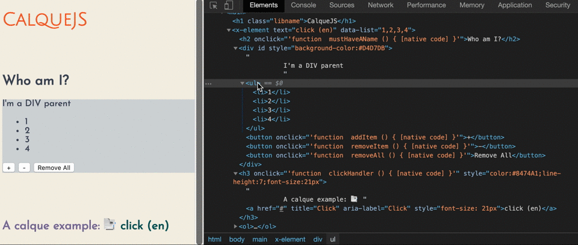

# calque.js 📑

🚧 Status: In Development 🛠️


CalqueJS is a tiny utility library (_~7KB_) aimed to help building interfaces easily for the native web platform. The goal is to offer a declarative way to code UI components by writing bits of HTML, rather the traditional client-side scripting.

It is based only on the Web Standards, so is 💪powered by [JavaScript](https://developer.mozilla.org/en-US/docs/Web/JavaScript), [DOM](https://developer.mozilla.org/en-US/docs/Web/API/Document_Object_Model) & [browser](https://developer.mozilla.org/en-US/docs/Web/API/Window) APIs to "transcript" the HTML-like template content into the base element. This approach suits to aid as an add-on for reusable [Web Components](https://www.webcomponents.org/). *No framework, no transpilation needed* \o/ #usetheplatform 

Just for curiosity, 🤔 _In linguistics, a [calque](https://en.wikipedia.org/wiki/Calque) /kælk/ or loan-translation is a borrowing of a compound word from another language where each component is translated into native words and then joined together._ 

This definition, resumes the approach behind CalqueJS, maximize the readability, avoid some boilerplate code, and enhance the component using a solid and well-known markup language to bootstrapping the content.


## Build components with a light abstraction

### Custom Elements v1 using ES6


```javascript
import { innerHTML, html } from '../dist/calque.mjs';

customElements.define('my-component', class extends HTMLElement {
  static get observedAttributes() { return ['text', 'data-list'];}
  constructor(...args) {
    super(...args);
  }
  attributeChangedCallback() { this.render(); }
  connectedCallback() { this.render(); }
  showNodeName() {
    alert(this.nodeName);
    this.setAttribute('name', 'Neo name');
  }
  render() {
    const colorProp = 'color';
    const name = this.getAttribute('name');
    this[innerHTML] = html`
      <p id="shaula" 
        onblur="${(e)=>console.log(e.target.textContent)}" 
        contenteditable>
        Temporary text
      </p>
      <h3 onclick="${this.showNodeName.bind(this)}" 
        style="${
          {
            [colorProp]: "red", 
            "font-size": name.length+"em"
          }
        }">
        Hello, &lambda; ${name}
      </h3>
      <div>
        <ul>
        ${
          this.hasAttribute('data-list') 
          && this.getAttribute('data-list').split(',').map(num => html`<li>${num}</li>`)
        }
        </ul>
        <button onclick="${
          (function removeItem() {
            if (this.hasAttribute('data-list')) {
              let list = this.getAttribute('data-list');
              let lastIndex = list.lastIndexOf(',');
              this.setAttribute('data-list', list.slice(0, lastIndex));
            } else {
              console.warn('No data-list attribute found');
            }
          }).bind(this) 
        }">-</button>
      </div>
    `;
  }
});

```


### Or for Web Component using ES5

```js
import {innerHTML, html} from '../calque.mjs';

function NeoTag() {
	console.log(this.constructor);
	this.count = 0;
	return Reflect.construct(HTMLElement, [], this.constructor);
}
NeoTag.prototype = Object.create(HTMLElement.prototype);
NeoTag.prototype.constructor = NeoTag;
Object.setPrototypeOf(NeoTag, HTMLElement);
NeoTag.prototype.handlerClick = function click(){
	console.log('clicked', this);
};
NeoTag.prototype.connectedCallback = function() {
	this.handlerClick = this.handlerClick.bind(this);
	this[innerHTML] = html`
        <p onclick="${this.handlerClick}">Neo Tag</p>
    `;
};

customElements.define('neo-tag', NeoTag);
document.body.appendChild(document.createElement('neo-tag'));
```

### A delightful and light VDOM-like approach



⚠️ **Warning**: The component built using CalqueJS it's intended to be concise and reflect the template content, with that said, the component DOM tree shouldn't be modified via DOM API (removing or adding new nodes).


## Install via:

1. [NPM](https://npmjs.com) (Terminal)
```sh
$ npm install --save calque
```

2. [UNPKG](https://unpkg.com/) (Web Browser)
```html
<script type="module" src="https://unpkg.com/calque@:version/dist/calque.mjs"></script>
```

## Features

🔧The motivation for CalqueJS comes basically inspired for what [JSX](https://reactjs.org/docs/introducing-jsx.html) represents for [React](https://reactjs.org/), I must say that it's very boring to use React without JSX, because it simplify the coding of a React component using a common HTML grammar. 

With the advent of Web Components, it's now possible to achieve some features provide by frameworks and libraries, but using the timeless advantage of the native web. The component pattern is one of the major benefit of Web Components, which enables to break the UI into distinct and small chunks of code providing a modular and reusable component to be used in many different contexts.


### Simplify web interface implementation.

Nothing new or needed to learned, the mantra is 🙏: _no 3rd party library APIs to interact, just some conveniences_. **Using CalqueJS is as easy as use template tags**. This feature was added at ES6 as he Template literals, which are simply functions that allows to create domain-specific languages (DSLs). For more details about The [HTML templating](http://exploringjs.com/es6/ch_template-literals.html#sec_html-tag-function-implementation), access the book _ExploringJS_ by Dr. Axel Rauschmayer.


### Some subtle differences and gotchas

When using the library, pay attention for this details mentioned below:

1. Adding Event Listeners smoothly: use function reference `onevent="myFunction"`, not function invocation `onevent="myFunction()"`. Note that in HTML, event listener names are written only in lowercase, such as onclick, onmouseover, etc. In some libraries, however, like JSX or lit-html, event listener names are written in camelCase or with the prefix @, such as onClick or @click, respectively. The philosophy behind CalqueJS is to avoid at the most any divergence from common HTML syntax.
2. Passing inline CSS properties not only through strings, but by literal objects too: when using styling objects, the [JSON](https://www.json.org/)-based format is mandatory. for example, you can pass a JSON object for the style attribute as`{[myProp]: "7px", "border-color": myValue}`. **OBS:** single properties names will work `{color: "blue"}` but are better to follow the standard rules.
3. Avoid use the **innerHTML** property directly. In JavaScript, you can use a variable value to access the respective property name (`var f='foo',o={foo:'bar'}; o[f] // outputs "bar"`), so instead of use `document.body.innerHTML` or `document.body["innerHTML"]`, you **must** import and use the `innerHTML` variable from CalqueJS, and them call `document.body[innerHTML]` together with the  `html` tagged template function provided (_html_ method is primarily a convenience function, and it can be especially useful when manipulating callback events).
4. Follow the [best practices](https://google.github.io/styleguide/htmlcssguide.html#HTML_Quotation_Marks), we use double quotes for attributes values.


#### Code Example

Use [Serve](https://github.com/zeit/serve) as recommended Web Server, run:

```sh
$ npm i serve
```

### Roadmap 🎯
There's quite a few things to be done:
- Attributes (not observed) updating
- Apply some code refactors (more functional programming style)
- Investigating Shadow DOM support

---
☑️ Suitable for web UI prototyping 👌

☢️ Not optimized for production ☣️ (use at your own risk)


### Some cool resources


https://github.com/w3c/webcomponents/
https://www.w3.org/wiki/WebComponents/
https://w3c.github.io/webcomponents/
https://developers.google.com/web/fundamentals/web-components/customelements
https://developer.mozilla.org/en-US/docs/Web/Web_Components/Using_custom_elements
